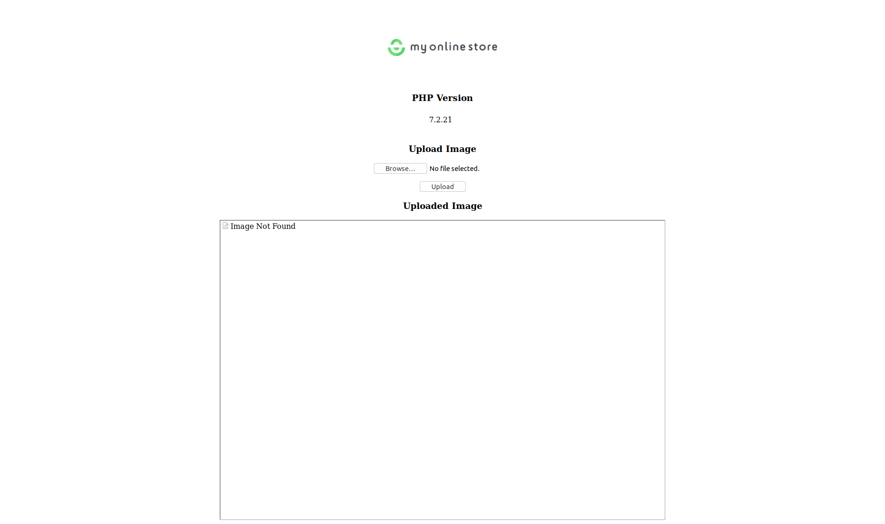
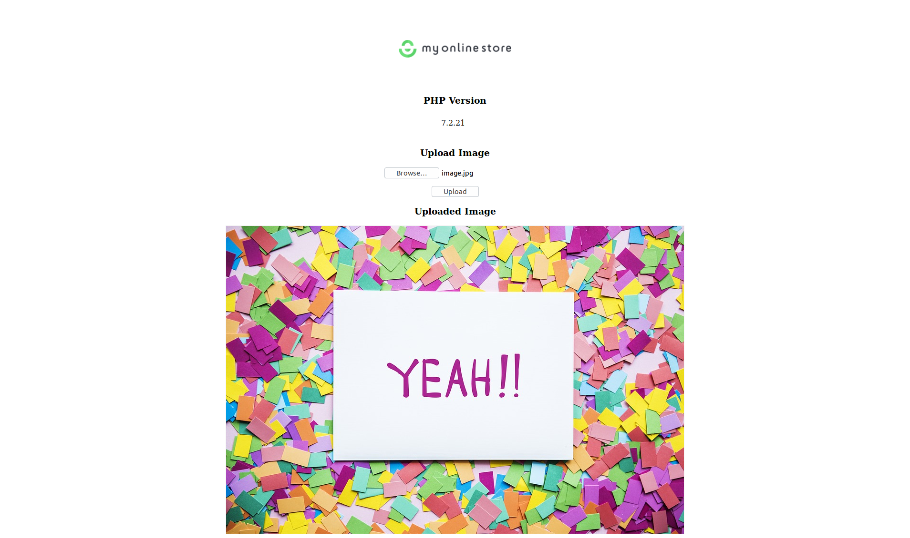

# Assessment

## Introduction
Hi there! 

First of all, thanks for your interest! This assessment is made out of 5 steps and heavily relies on your Docker knowledge and/or inquisitiveness. As most of the time in the technical world there are multiple paths you can take. Which one do you take, and can you e.g. explain why you've made choice X over Y? 

> This assessment will contain a small example application written in PHP. No worries though! Knowledge about PHP is not a requirement for this assessment. 

## Tasks

### Task #1 - Docker
Create a working Docker container to serve the `app/` content.

**Requirements**
- The used PHP [SAPI](https://en.wikipedia.org/wiki/Server_Application_Programming_Interface) needs to be [fpm](https://www.php.net/manual/en/install.fpm.php);
- The container(s) can be started through [docker-compose](https://docs.docker.com/compose/);
- The content must be served from the `/app` directory within the container;
- The web server needs to be exposed on port `8123`.

The end result should look something like this (The PHP version may differ):


### Task #2 - Storage
Try to upload the image as provided in `resources/image.jpg` and get the storage system to work according the set requirements.

**Requirements**
- The following file needs to be uploaded: `resources/image.jpg`;
- The uploads needs to be placed in `/app/uploads`;
- The uploaded image persists over container restarts.

The end result should look something like this (The PHP version may differ):


### Task #3 - Security
Mark the container(s) as read-only.

**Requirements**
- The upload functionality as described in Task #2 should still work.

The end result should look something like this:
```shell script
# executed within the running container
touch /home/hello.txt
> touch: /home/hello.txt: Read-only file system
```

### Task #4 - Deployment
As requirement in Task #1 you probably have used `docker-compose` until now. This tool is very powerful for local development and testing but for deployments, not so much. With this final step we want you create a "production"-ready Docker image that can be deployed to Kubernetes.

**Requirements**
- The image tag needs to be prefixed with `sandwich-sre\`;
- The directory `app/` may not be used as a direct volume mount;
- When starting the container the application should be fully functional (as per previous steps);
- Create the YAML file(s) that are needed to deploy the application image to a Kubernetes cluster.

### Task #5 - Automation
Task #4 is a combination of several commands and actions. Can you find a clever way to automate this?

**Requirements**
- The image tag prefix needs to be configurable;
- There should be an easy way to build and start the containers;
- Use any kind of template tooling that enables the deployment of a variety of images, preferably also usable for different applications.
